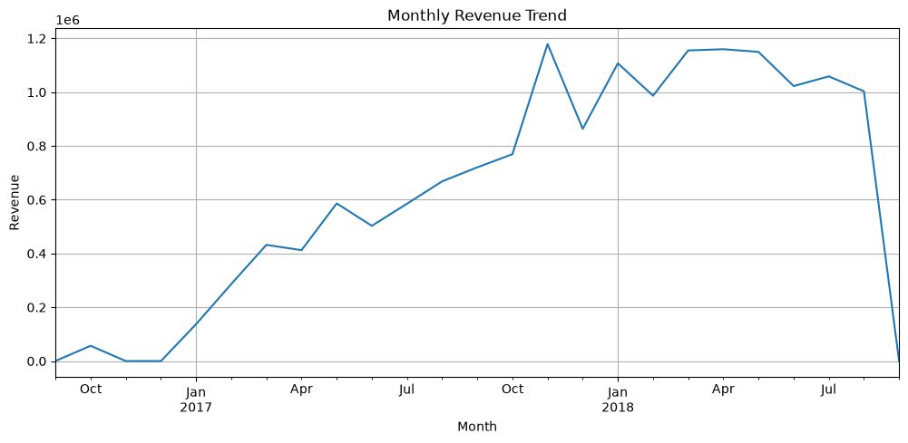
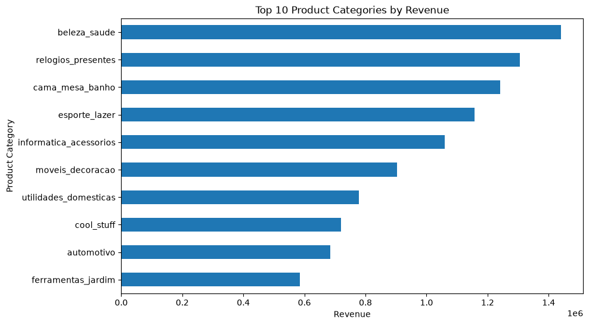
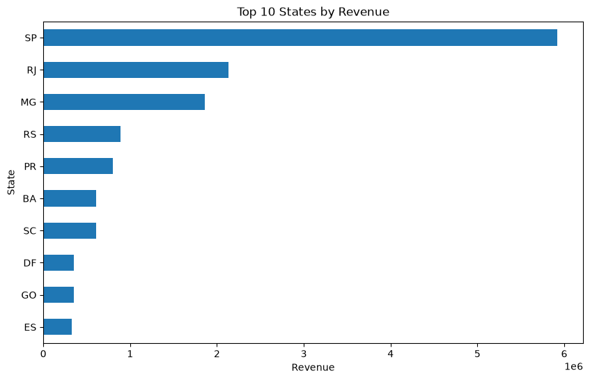
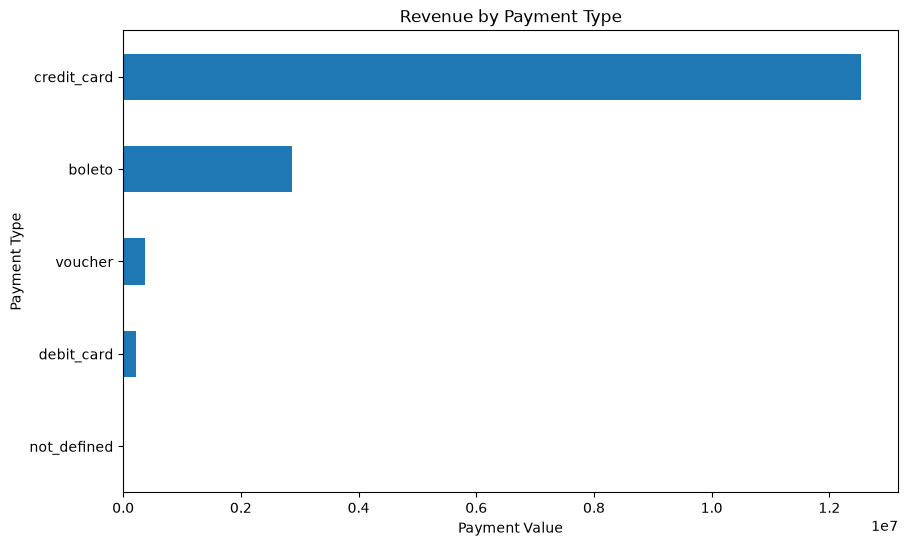
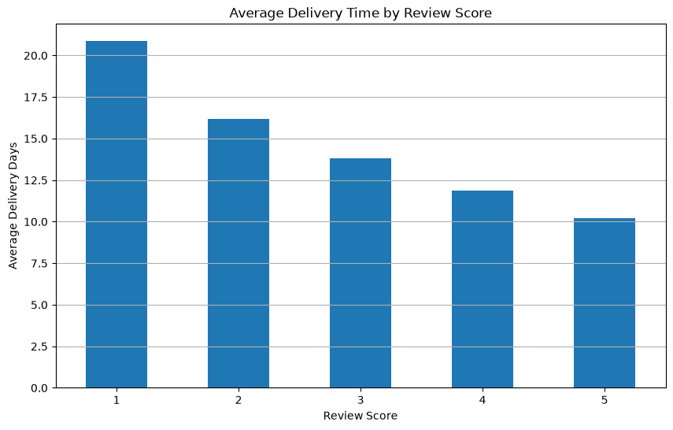

# Brazilian E-Commerce Data Analysis

## Project Overview

This project performs an Exploratory Data Analysis (EDA) of Brazilian e-commerce data to understand sales performance,
customer distribution, product categories, payment behavior, delivery performance, customer satisfaction, and order cancellations.
The analysis focuses on identifying meaningful business patterns and insights from the available e-commerce data.

## Objectives

- Analyze overall sales and order performance
- Understand customer distribution across Brazilian states
- Identify high-revenue product categories
- Analyze payment methods and installment behavior
- Examine delivery performance
- Investigate the relationship between delivery time and customer review scores
- Analyze order cancellations and their geographic distribution

## Tools & Technologies

- Python
- Pandas
- NumPy
- Matplotlib
- Jupyter Notebook

## Key Insights

- The dataset contains 99,441 orders.
- The overall cancellation rate is approximately 0.63%.
- São Paulo (SP) has the highest number of customers and generates the highest total revenue.
- Beauty and personal care (`beleza_saude`) is the highest-revenue product category among the analyzed categories.
- Credit cards are the dominant payment method.
- The business shows a strong preference for single-payment transactions, while credit-card users account for most installment activity.
- Monthly orders and revenue generally increased over the observed period, with strong performance around late 2017 and early 2018.
- Delivery time is negatively correlated with review score, with a correlation of approximately -0.33.
- Customers giving 5-star reviews received their orders in approximately 10.2 days on average, compared with approximately 20.8 days for 1-star reviews.
- Cancelled orders are concentrated in larger customer markets, particularly SP, RJ, and MG.
 
## Visualizations

### Monthly Revenue Trend



### Top 10 Product Categories by Revenue



### Top 10 States by Revenue



### Revenue by Payment Type



### Average Delivery Time by Review Score




## Project Structure

```text
Brazilian-eCommerce-Data-Analysis/
│
├── Olist_EDA.ipynb
│
├── monthly_order_trend.png
├── monthly_revenue_trend.png
├── top_10_product_categories_revenue.png
├── top_10_states_customers.png
├── top_10_states_revenue.png
├── top_states_avg_revenue.png
├── top_states_avg_revenue_500_customers.png
├── revenue_by_payment_type.png
├── average_installments_payment_type.png
├── average_payment_value_installments.png
├── lowest_rated_product_categories.png
├── average_delivery_time_review_score.png
├── cancelled_orders_by_state.png
│
└── README.md
```text

## Conclusion

The analysis provides an overview of sales performance, customer distribution, product categories, payment behavior, delivery performance, and
customer satisfaction in Brazilian e-commerce data.One of the key findings is the relationship between delivery time and customer satisfaction.
Lower review scores are associated with longer delivery times, suggesting that improving delivery performance could potentially contribute to better
customer satisfaction.Overall, the analysis highlights the importance of monitoring revenue trends, regional performance, payment behavior, cancellations,
and delivery efficiency when making e-commerce business decisions.

## Author

**Snehal Devadkar**
